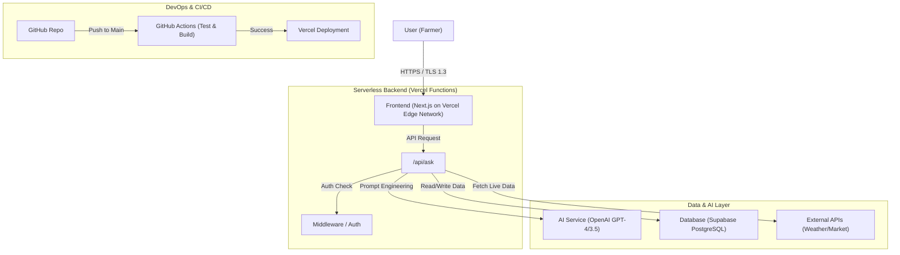

# Professional Engineering Architecture

## System Architecture Diagram



## Scalability & Performance
-   **Frontend**: Hosted on Vercel's Edge Network (Global CDN), ensuring low latency worldwide.
-   **Backend**: Serverless functions scale automatically from 0 to 1000s of concurrent requests.
-   **Database**: Supabase (PostgreSQL) handles complex queries and can scale vertically or with read replicas.
-   **AI**: OpenAI API handles the heavy lifting of natural language processing.

## Security Standards
1.  **HTTPS**: Enforced for all connections.
2.  **Environment Variables**: All sensitive keys (`OPENAI_API_KEY`, `SUPABASE_KEY`) are stored in Vercel Environment variables, never in code.
3.  **Input Validation**: All API inputs are validated before processing to prevent injection attacks.

## Folder Structure (Production Ready)
```
/
├── .github/workflows/    # CI/CD Pipelines
├── src/
│   ├── app/              # Next.js App Router (Frontend + API)
│   ├── components/       # Reusable UI Components
│   ├── lib/              # Shared Libraries (Supabase, OpenAI, Utils)
│   ├── hooks/            # Custom React Hooks
│   └── styles/           # Global Styles
├── public/               # Static Assets
└── tests/                # Automated Tests
```
